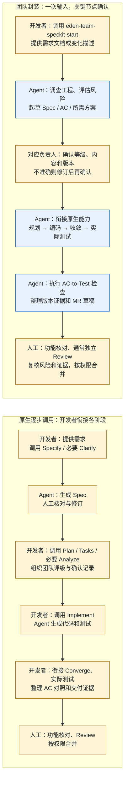

# Agent-Native SDLC

以 GitHub Spec Kit 原生能力为基础，采用 Flow-forward、L0–L3 与 AC-to-Test，逐步形成可推广的团队研发标准。

当前：仓库已初始化，已完成部分原生能力核验和 Maven AC-to-Test 实验原型；尚未接入业务工程或完成两个客户端验证。

当前在个人电脑准备完整方案，后续公开 GitHub 分发通用材料，在受 MDM 管控的工作 MacBook 按手册验证。公开发布尚未执行。

## 开发同学从这里开始

先读 [开发者使用说明：提交需求，让 Agent 推进 L0～L3 工作流](docs/developer-guide.md)。调用统一 Skill `eden-team-speckit-start`，提供需求文档或功能变化描述，无需预先评级；Agent 先依据工程评估风险，再起草相应 Spec/AC，在关键确认后继续规划、编码和测试；开发者核对准确性与最终功能。

维护者按 [Spec Kit 与 Skill 接入说明](docs/skill-integration.md)完成一次接入。已实现原生 [team-sdlc Extension](extensions/team-sdlc/extension.yml)，原生注册保持原样；对外使用 [skills/ 下的五个薄入口](skills)，统一为 eden-team-speckit-start / l0～l3；所有入口都必须评估风险；两个真实客户端的行为仍待验证。

日常速查：L0 Mini-Spec + 单 MR；L1 单 MR 先确认 Spec/AC；L2 单 MR 再确认技术方案；L3 Spec MR + 实现 MR。所有等级都保留实际验证与最终人工审核。

## 一次任务怎样推进

工程完成首次接入后，开发者调用 `eden-team-speckit-start`，提供需求文档或功能变化描述，无需先选择 L0～L3。入口由当前 Agent 会话执行，下面是约定的执行过程；实际客户端端到端行为仍待验证。

| 阶段 | Agent 做什么 | 人工参与与交付物 |
|---|---|---|
| 1. 接收需求、调查工程 | 读取需求、项目规范、相关代码、调用关系、接口、数据与测试；集中提出关键疑问 | 开发者提供需求、补充真实业务规则；保留输入依据和未决问题 |
| 2. 风险评估 | 按工程证据与团队规则建议等级，展示命中条件、影响面及未知项 | L0/L1 模块负责人、L2/L3 技术负责人确认；可与 Spec/方案一起确认 |
| 3. 生成规范产物 | L0 起草 Mini-Spec；L1～L3 复用 Specify/必要 Clarify 生成增量 Spec 和带 ID 的 AC；L2/L3 起草所需 Plan | 人工核对目标、范围、边界和验收含义；不准确时修订同一活跃变更 |
| 4. 确认开工 | 展示具体版本，核对确认角色、范围与来源；缺确认时保持暂停 | 对应负责人确认等级和需求；L2 增加技术方案确认，L3 先批准并合入 Spec MR |
| 5. 自动实施 | 衔接原生 Plan、Tasks、必要 Analyze、Implement，生成代码并编写或复用真实测试 | 通常无需逐步操作；新业务疑问、关键方案变化或风险升级才重新确认 |
| 6. 自动验证 | 显式 Converge，运行实际 Maven 测试与 AC-to-Test 检查，在已确认范围内修复并重跑 | 产出被测版本、逐 AC 结果、原始报告引用、失败/跳过/未验证项；人工协助处理环境或业务阻塞 |
| 7. 功能核对与交付 | 复评实际 diff，准备人工验收步骤、证据与 MR 草稿；完成后保留 Spec 历史、同步长期设计 | 开发者验证功能，通常另一位开发者复核风险、逻辑和证据，再按平台权限合并 |

风险评估贯穿全过程：任何入口都必须评估，不能因选择 L0 而降级；Plan 明确影响面、实施发现新影响和最终 diff 时都要复评。关键风险未知先调查，升风险先停止相关实施，降级需降级前等级对应负责人留痕。评级目前由 Skill 规则、负责人和 Reviewer 共同约束，尚无已验证的机器强制评级门禁。

确认后 Agent 自动衔接工程步骤，不再逐项询问是否生成 Plan、Tasks 或开始编码。开发者纠正需求时，Agent 修订当前 Spec/AC，说明受影响的方案和测试，重新确认关键内容后继续。L1/L2 使用单 MR 分阶段，L3 使用 Spec MR + 实现 MR；功能验收、Review、合并和生产授权分别记录。

## 原生逐步使用与封装后的对比

图左侧以“开发者逐条调用原生能力”的方式作为对照。Spec Kit 原生也提供 Workflow 等组合机制；本封装将团队风险分级、确认节点、AC-to-Test 和交付规则集中到一个可调用入口，继续复用原生能力。当前 generic CLI Workflow 不能派发桌面 App，因此由当前 Agent 会话衔接步骤。

图中浅黄色表示有人参与的节点，浅蓝色表示由 Agent 自动推进的节点。为便于对照，图中省略修订、失败重试和风险升级回路；发生这些情况时仍按上文暂停或复评。L0 裁剪为 Mini-Spec 与必要验证，L2/L3 保留各自额外确认和 MR 路径。

开发者看到的简化步骤是：**提供需求 → 补充并确认 → 等待 Agent 实施与验证 → 核对功能与交付**。这四步可以因业务修订或风险变化迭代；角色确认不能由 Agent 代替。

| 对比项 | 直接逐步使用原生能力 | team-sdlc 封装后的日常使用 |
|---|---|---|
| 入口与操作 | 开发者选择并衔接各阶段能力 | 一个 start 入口接收需求，Agent 按规则衔接 |
| 风险分级 | 额外组织团队规则、影响分析和确认记录 | 每个入口都包含基于工程证据的评估、对应角色确认及复评约定 |
| 文档生成 | 原生 Agent 能力生成 Spec/Plan/Tasks，人工核对内容 | 继续复用原生产物，按风险自动选择深度、增加稳定 AC ID，开发者主要补充和确认 |
| 验收与证据 | 另外衔接项目测试、AC 对照和版本记录 | Agent 衔接实际测试、AC 检查器和版本证据；人工核验真实语义 |
| 人工注意力 | 内容确认、阶段调用、流程接力和交付核对 | 主要集中在业务/技术确认、关键异常和最终功能/Review |

封装的价值是减少日常调度与记录遗漏、统一团队约定；实际耗时、自主交付率和质量提升需通过试点测量。已验证的是入口安装/移除与验收检查器，不代表上图已在 Continue 自研插件和 Qoder 独立 App 中完整跑通。

具体调用、修订、角色确认和维护者安装方法见 [开发者指南](docs/developer-guide.md)与[接入说明](docs/skill-integration.md)。

## 阅读入口

- [主技术设计](docs/technical-design.md)：已决策路线、生命周期、风险分级和验收设计。
- [实施任务接力](docs/implementation-handoff.md)：T0–T6 的依赖、操作与验收条件。
- [项目记忆](docs/memory.md)：事实、当前进度、待确认事项和下一步。
- [原生能力核验](docs/research/native-capability-audit.md)：锁定版本、运行结果与最小差距。
- [工具兼容矩阵](docs/research/tool-compatibility.md)：Continue 自研插件与 Qoder 独立 App。
- [ADR-0001](docs/adr/0001-native-first-flow-forward.md)：原生优先与生命周期决策。
- [ADR-0002](docs/adr/0002-gitlab-manual-verification.md)：无自动 CI 触发时的第一版交付路径。
- [ADR-0003](docs/adr/0003-maven-acceptance-prototype.md)：最小 Maven 验收原型的取舍与边界。
- [ADR-0004](docs/adr/0004-native-task-entrypoints.md)：原生四级入口与会话衔接的实现选择。
- [团队操作基线](docs/team-operating-profile.md)：已确认的审批路径、风险负责人及待批准细则。
- [Maven 验收契约](docs/acceptance-contract.md)与[检查器操作说明](scripts/README.md)：最小映射、手动运行及限制。
- [GitLab 手动验收路径](docs/gitlab-manual-verification.md)：无自动流水线时如何形成可复核证据。
- [工作电脑验证手册](docs/work-mac-validation.md)：材料获取、环境预检、真实客户端与业务试点。
- [验证案例](docs/validation-cases.md)：正例、负例和实际约束边界。
- [公开发布与迁移](docs/public-release.md)：公开/内部边界、版本与工作电脑接力。

## 可复用模板

[验收记录](templates/verification-record.md)、[工作电脑验证结果](templates/workstation-validation-record.md) 和 [.gitlab/merge_request_templates](.gitlab/merge_request_templates) 下的 MR 模板可作为起点。模板没有预填通过结论，也不是强制门禁。

## 已知团队环境

团队使用自部署 GitLab，无法自动触发 CI。第一版采用“人工发起工作流，Agent 在允许环境运行已有测试 → 生成绑定代码版本的证据 → GitLab Merge Request 人工审核”的路径。是否能手动触发流水线、是否有 Runner、能否强制审批/保护分支仍待核验。

不以引入 Spec Kit 为由更换 Git 平台、测试框架或客户端；CI 保持为架构能力，当前落地强度据实记录。

## 仓库边界

已有 team-sdlc Extension 0.1.1 和 AC 映射/报告检查原型，复用原生能力并提供会话内衔接，不承担 CI 或审批服务。尚无团队 Preset、CLI Workflow 或 Bundle；先验证真实行为再标准化分发。work/ 与 .venv/ 为忽略的临时研究环境，不能当作正式分发物。
